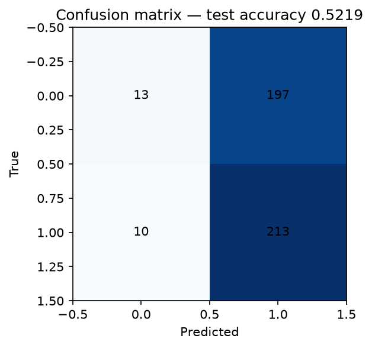
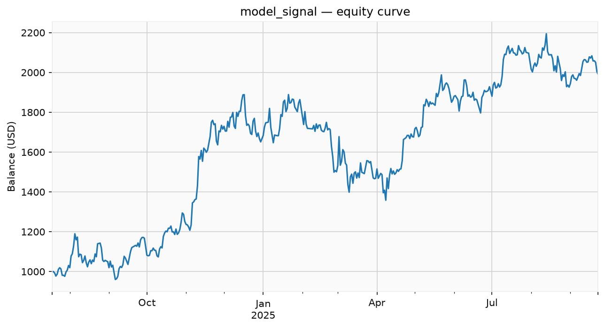
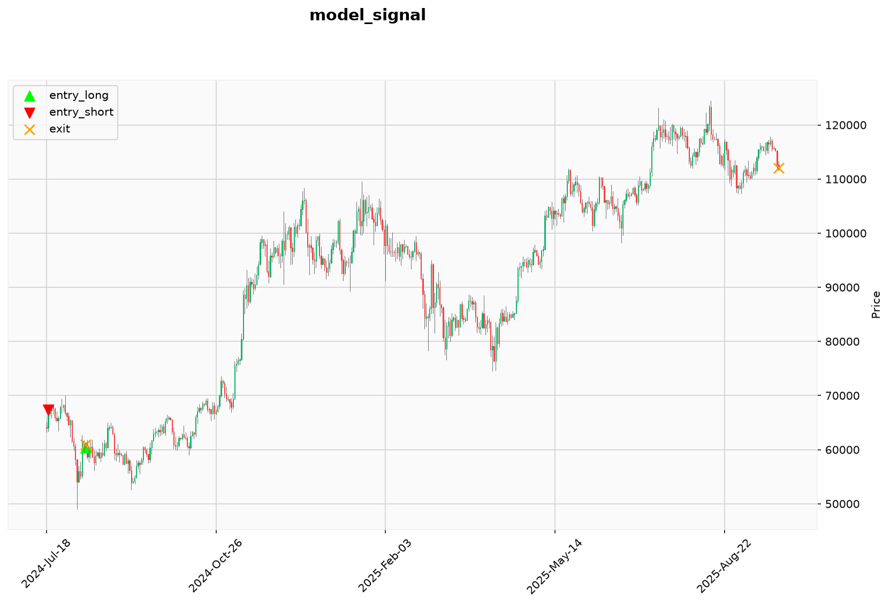
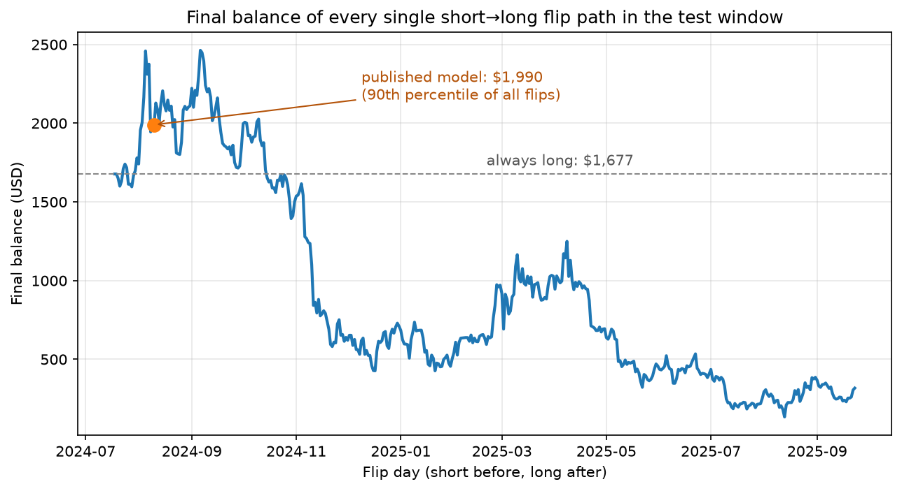
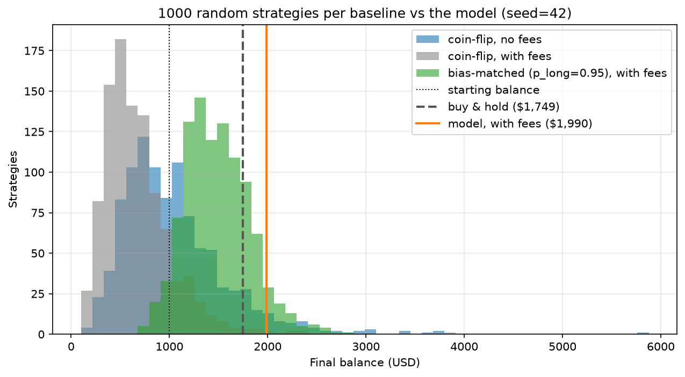

# BTC Direction Prediction: A Replication Study

Papers keep reporting 70%+ accuracy (some as high as 90%) predicting whether Bitcoin closes up or down tomorrow, using CNNs/LSTMs over technical indicators and on-chain metrics. This project sets out to debunk those claims on their own terms: same target, same feature families, same model class the papers use. Rebuilt with an evaluation designed so that leaking, peeking, or cherry-picking is structurally impossible. It finds what an efficient market says it should find:

**~52% test accuracy, statistically indistinguishable from the 51.5% always-long base rate and a "winning" trading signal that is just buy-and-hold plus one lucky flip.**

A companion experiment (`leakage_demo.py`) then shows how the headline numbers get manufactured and it isn't the leak that usually gets blamed. The full mathematical specification of the pipeline, every formula from raw CSV to reported Sharpe, and why each design choice closes a specific loophole is in [MODEL.md](MODEL.md).

## The replication experiment

Same data, same features, same models, only the evaluation bugs differ:

| Arm | Test accuracy |
|-----|--------------:|
| Honest CNN (causal z-scores, chronological split) | 52.0% |
| Honest LightGBM baseline | 54.0% |
| Bug A: CNN, scaler fit on the full dataset + shuffled split | 50.9% |
| Bug B: CNN, label's move already inside the feature window | 53.4% |
| **Bug B: LightGBM, same misaligned label** | **97.5%** |

Two things fell out of this that I didn't expect:

- **The usually-blamed leaks barely matter for direction targets** (bug A). Daily up/down labels are near-independent coin flips, so fitting the scaler on all data and shuffling overlapping windows into train/test has almost no signal to leak.
- **Target misalignment is the real accuracy machine** (bug B). Label a sample with a price move its features already contain a one-line indexing bug when building sequences  and a tabular model scores 97.5% instantly. The Conv1D is largely immune only because `GlobalAveragePooling1D` is position-blind and can't isolate a leak parked in the window's last row. Many published pipelines are one `shift(-1)` away from this bug, and 65–90% claims are consistent with partial versions of it (features that encode the labeled move indirectly).

Reproduce with `python leakage_demo.py` (→ `results/leakage_demo.csv`).

## The honest model, honestly evaluated

The model is a 1D convolutional network over 40-day windows of three feature families (the same kinds of inputs the papers use):

- **On-chain metrics**: MVRV, SOPR, NUPL, hashrate, hodl waves, miner balances and more. 24 daily CSVs from [bitcoin-data.com](https://bitcoin-data.com). **These files are not distributed with this repo**: bitcoin-data.com's terms don't allow redistributing downloaded data. [assets/FEATURES.md](assets/FEATURES.md) lists every file, the exact date ranges used, and how to download them yourself (free but manual).
- **Macro markets**: gold, oil, S&P 500, VIX, treasury futures and more (fetched automatically from Yahoo Finance)
- **Technical indicators**: RSI, MACD, Bollinger Bands, SMAs/EMAs, ATR, OBV, VWAP (computed from the OHLCV data)

See [MODEL.md](MODEL.md) for the formula-by-formula specification.

```
assets/*.csv ─┐
Yahoo Finance ┼─► data.py ──► model.py ──► results/best_test_dataset.csv ──► backtest.py ──► results/
              ┘   (dataset)   (train)      (predictions)                     (evaluate)      (metrics + charts)
```

The evaluation is built to make lying hard:

- chronological 60/20/20 split; the validation region runs as 3 walk-forward folds, each training on everything before its slice
- causal rolling z-scores (90-day trailing window),  no scaling statistic ever sees the future
- LightGBM feature selection refit inside each fold, on that fold's training data only
- hyperparameter search (400 random trials) selects on *mean validation backtest Sharpe including fees*, not accuracy
- the test set is evaluated exactly once, by the single search winner

The result (`results/best_params.json`): validation Sharpe 3.27 collapses to **test Sharpe 1.29**, validation accuracy 56.1% to **test accuracy 52.2%** against an always-long base rate of 51.5%. That gap is selection bias made visible. The best of 400 trials always looks great on the data that chose it. And the winning model is barely a model at all: it opens the test window short, flips long on 2024-08-10, and stays long for the remaining 410 of 433 days. The confusion matrix shows the degeneracy directly; 410 of 433 predictions are "up":



## Backtest

Test window Jul 2024 → Sep 2025 (433 days), $1,000 start, 0.1% taker fee per side, equity marked to market daily (open positions valued at every close, so drawdowns during a trade are real, not just booked-at-exit):

| Strategy | Return | CAGR | Sharpe | Max drawdown | Win rate | Trades |
|----------|-------:|-----:|-------:|-------------:|---------:|-------:|
| **Model signal** | **+99%** | 79% | 1.44 | -28% | 100% | **2** |
| Buy & hold | +75% | 60% | 1.17 | -28% | 51% | — |
| Bollinger (long+short) | +71% | 60% | 1.69 | -12% | 65% | 23 |
| Bollinger (long only) | +53% | 45% | 1.60 | -7% | 80% | 10 |
| Bollinger (short only) | +12% | 11% | 0.46 | -12% | 54% | 13 |

This time the model signal *beats* buy-and-hold and that is the trap. The entire edge is one trade: the model opens the test window short, happens to catch the early-August 2024 crash, flips long on 2024-08-10 and never trades again. Two trades, 100% win rate, infinite profit factor; numbers that clean are a sample-size warning, not an edge. The direction calls behind it are 52.2% accurate against a 51.5% always-long base rate, so the outperformance is one lucky flip, not skill; a search seeded differently would crown a winner whose single flip lands somewhere less fortunate.





- **Model signal**: always in the market. Long while the model predicts up, short when it predicts down.
- **Bollinger Bands**: mean reversion. Buy below the lower band, short above the upper band, exit at the middle band or a 3% stop loss.
- **Buy & hold**: the baseline every crypto strategy must beat.

Metrics per strategy: total return, CAGR, Sharpe, Sortino, Calmar, max drawdown, profit factor and win rate (see `evaluate()` in `backtest.py`).

## Robustness

A single test window is one draw from one regime, and no analysis of that window can substitute for other regimes. What *can* be measured is how fragile the model's win is inside the published window (`python robustness.py`, under a minute, offline):

- **The edge lives in one 90-day slice.** Backtesting each consecutive 90-day sub-window standalone (`results/robustness.csv`): the model beats buy-and-hold only in the first slice (+19.1% vs +4.7%), the one containing the August 2024 crash it happened to be short for. In every later slice it predicts "up" every single day, so its accuracy equals the base rate and its return just tracks buy-and-hold.
- **The winning flip is a lucky member of its own family.** The model is one of 434 possible "short until day $d$, then long forever" paths. Backtesting all of them (`results/robustness.json`): only 80 of 434 beat always-long, the median path ends at \$653 vs \$1,677 for always-long, and the published flip day sits at the 89.9th percentile. (Always-long here is the $d=0$ member of the family, which enters at the first tradable close and pays both fees, hence slightly below the buy-and-hold row above.)
- **The accuracy is statistically nothing.** 226 correct calls in 433 days against a 51.5% base rate: a zero-skill coin weighted at the base rate scores 226 or better with probability **p = 0.405** (one-sided binomial). Nowhere near significant.
- **Beating "random trading" is baseline-shopping, not evidence.** 1,000 seeded random strategies, backtested with and without fees (`seed=42`, `results/robustness.json`). Against daily coin-flips (long or short, 50/50) the model beats 99.3%, but that baseline is a strawman: long only half the days, a coin-flip captures none of the trend and pays a fee round trip every other day (median \$608; 86% lose money in a market that rose 75%). Match the randomness to the model's own 95% long bias instead, so chance rides the trend exactly like the model does, and 95% of the zero-information strategies end profitable and **63 of 1,000 beat the model outright** (93.7th percentile, p ≈ 0.06, below the top-decile flip paths above, and never past the 5% significance bar). Each fairer baseline shrinks the edge: coin-flip median \$608 → same-bias median \$1,450 → buy-and-hold \$1,749 → model \$1,990. How strong the model looks depends entirely on how weak a baseline it is compared against.





## Quick start

Requires Python 3.12.

```bash
python3.12 -m venv .venv
source .venv/bin/activate
pip install -r requirements.txt

python backtest.py        # seconds, offline: backtests the included predictions,
                          # writes results/metrics.csv + charts
python robustness.py      # ~1 min, offline: sub-window, flip-sweep, binomial
                          # + random-baseline checks
python test_backtest.py   # strategy unit tests + checks every number in this README
                          # against the results/ artifacts; prints "ok"
python leakage_demo.py    # ~10 min on CPU: the honest-vs-bugs accuracy table
python model.py 400      # optional: retrain with 400 search trials
                          # (hours on CPU; defaults to 50 if omitted)
```

Trained artifacts and predictions are included, so `backtest.py` and `test_backtest.py` work immediately with no data downloads. `leakage_demo.py` and `model.py` rebuild the dataset, which requires the on-chain CSVs (follow [assets/FEATURES.md](assets/FEATURES.md) to download them first (they can't be redistributed here).

## Project structure

```
├── assets/            # input data location
│   └── FEATURES.md    # every metric to download, exact filenames + date ranges
├── results/           # everything the pipeline produces
├── MODEL.md           # the mathematics of the pipeline, formula by formula
├── data.py            # dataset assembly + feature engineering
├── model.py           # training + hyperparameter search
├── backtest.py        # strategies, metrics, charts
├── robustness.py      # stress-tests the model's win inside the test window
├── leakage_demo.py    # reproduces paper-level accuracy via evaluation bugs
├── test_backtest.py   # strategy unit tests + README-vs-artifacts regression checks
├── requirements.txt
└── LICENSE            # MIT
```

## Honest limitations

Fees are modeled (0.1% per side) but slippage, funding costs on shorts, and margin mechanics are not. Everything rests on one test window in one market regime; the [Robustness](#robustness) section quantifies how little the "win" inside that window means, but only fresh data from other regimes could test the conclusion elsewhere. On-chain metrics are consumed at each day's close, though in production some publish with a lag. None of this changes the conclusion, it only makes the negative result more negative.

This is a research project, not financial advice. The finding is the product: next-day BTC direction is not predictable from public daily data with this approach, and claims otherwise deserve a hard look at their target alignment.
